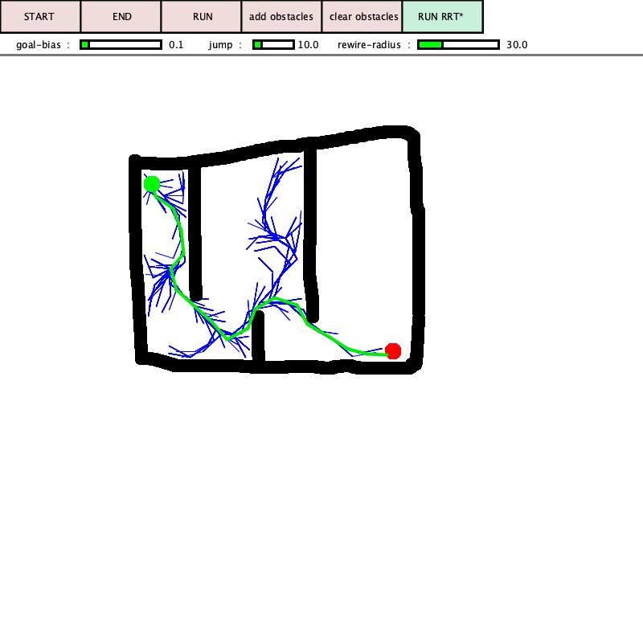
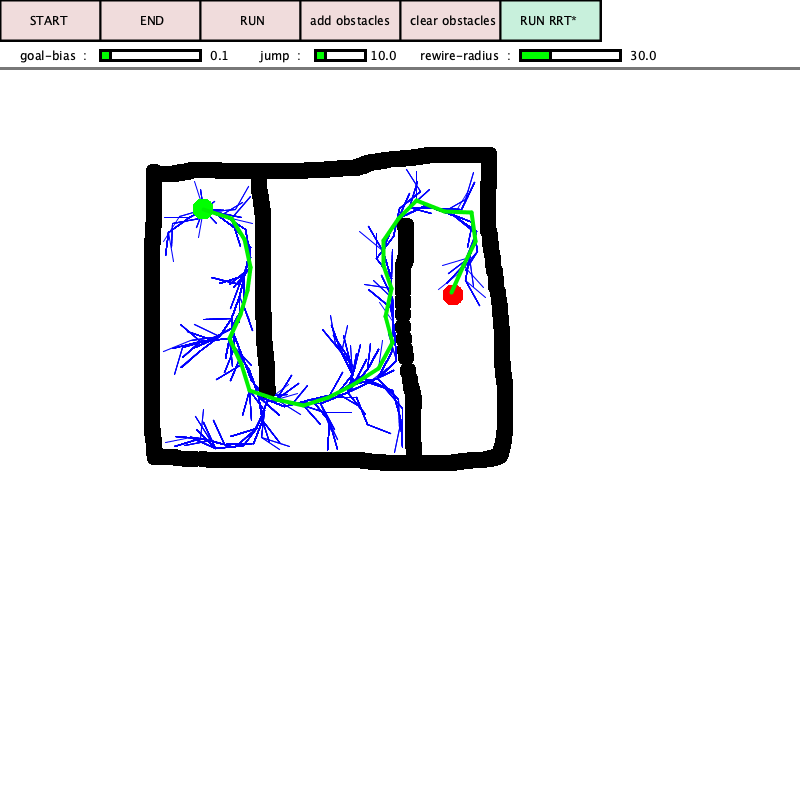

# RRT-pathplanning

RRT and RRT* animated using processing

## GUI

* Add start and end points
* Draw obstacles 
* Set desired goal bias, jump(random step length) and rewiring radius
* RUN(rrt) or RUN RRT*(rrt-star)
## Sample Results

<table>
  <tr>
    <td></a></td>
    <td></a></td>
  </tr>
</table>

